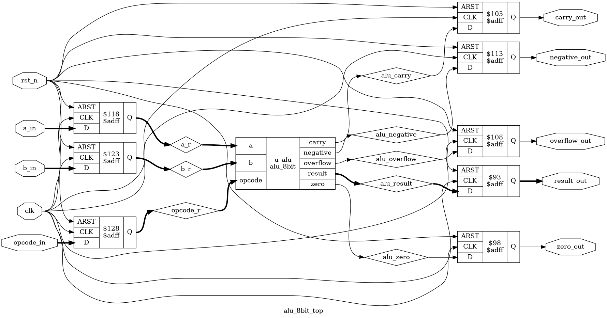
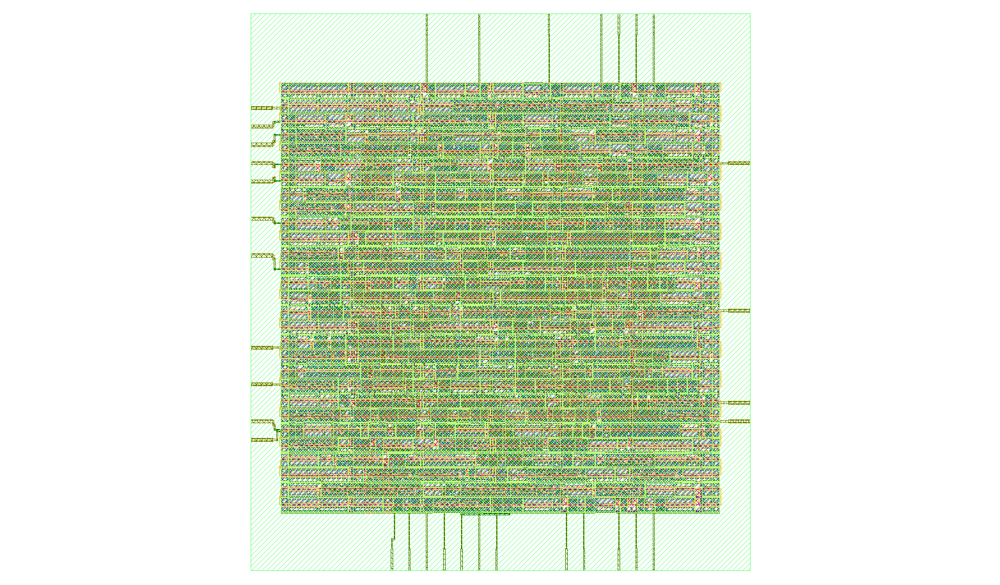

# 8-bit ALU ASIC Design using OpenLane 2

An 8-bit Arithmetic Logic Unit (ALU) designed in Verilog, functionally verified using Icarus Verilog and GTKWave, and implemented through the complete RTL-to-GDSII ASIC design flow using OpenLane 2 with the Sky130 PDK.

---

## Project Overview

This project demonstrates the complete ASIC implementation flow of an 8-bit ALU, starting from RTL design and functional verification to physical implementation and GDSII generation.

The design was synthesized, floorplanned, placed, clock-tree synthesized, routed, and verified using the OpenLane 2 automated RTL-to-GDSII flow.

---

## Features

- 8-bit Arithmetic Logic Unit
- Verilog RTL implementation
- Functional simulation using Icarus Verilog
- Waveform verification using GTKWave
- RTL schematic generation using Yosys
- Complete ASIC implementation using OpenLane 2
- Sky130 PDK
- Successful GDSII generation
- Passed DRC, LVS and Antenna checks

---

## Supported Operations

| Opcode | Operation |
|---------|-----------|
| 0x0 | Addition |
| 0x1 | Subtraction |
| 0x2 | Increment |
| 0x3 | Decrement |
| 0x4 | Bitwise AND |
| 0x5 | Bitwise OR |
| 0x6 | Bitwise XOR |
| 0x7 | Bitwise NOT |
| 0x8 | Logical Left Shift |
| 0x9 | Logical Right Shift |
| 0xA | Rotate Left |
| 0xB | Rotate Right |
| 0xC | Compare |
| 0xD | Pass A |
| 0xE | Pass B |
| 0xF | Clear Output |

---

## Tools Used

| Tool | Purpose |
|------|---------|
| Verilog | RTL Design |
| Icarus Verilog | Simulation |
| GTKWave | Waveform Analysis |
| Yosys | RTL Synthesis & Schematic |
| OpenLane 2 | RTL-to-GDSII Flow |
| OpenROAD | Physical Design |
| Magic | DRC |
| Netgen | LVS |
| KLayout | GDSII Visualization |
| Sky130A PDK | Technology Library |

---

## Repository Structure

```
ALU_8bit/
│
├── README.md
├── config.yaml
├── alu.v
├── alu_top.v
├── alu_tb.v
├── metrics.csv
├── rtl_schematic.png
├── waveform.png
└── alu_layout.png
```

---

# RTL Schematic



---

# Functional Simulation

The ALU functionality was verified using Icarus Verilog. Different ALU operations were applied through the opcode input, and the output was verified using GTKWave.


---

# Physical Layout

The synthesized netlist was successfully implemented using OpenLane 2. The design completed the full RTL-to-GDSII flow without DRC or LVS violations.



---

# OpenLane Implementation Summary

- RTL Synthesis ✔
- Floorplanning ✔
- Placement ✔
- Clock Tree Synthesis ✔
- Routing ✔
- DRC Clean ✔
- LVS Clean ✔
- Antenna Clean ✔
- GDSII Generated ✔

---

# Implementation Results

The detailed implementation statistics are available in **metrics.csv**.

Example metrics include:

- Total Standard Cells
- Core Area
- Utilization
- Wire Length
- Timing Summary
- Power Estimation
- DRC Violations
- LVS Status

---

# Running Simulation

Compile the design:

```bash
iverilog -o alu_sim rtl/alu.v rtl/alu_top.v alu_tb.v
```

Run simulation:

```bash
vvp alu_sim
```

Open waveform:

```bash
gtkwave dump.vcd
```

---

# ASIC Flow

Run the OpenLane flow:

```bash
python3 -m openlane config.yaml
```

---

# Results

- Functional Verification Passed
- RTL Schematic Generated
- Waveform Verified
- Successful RTL-to-GDSII Implementation
- Final GDSII Generated
- Layout Verified
- DRC Passed
- LVS Passed
- Antenna Check Passed

---

## Future Improvements

- Pipelined ALU Architecture
- Low-Power Optimization
- Parameterizable Data Width
- Enhanced Timing Optimization
- Support for Additional Arithmetic Operations
